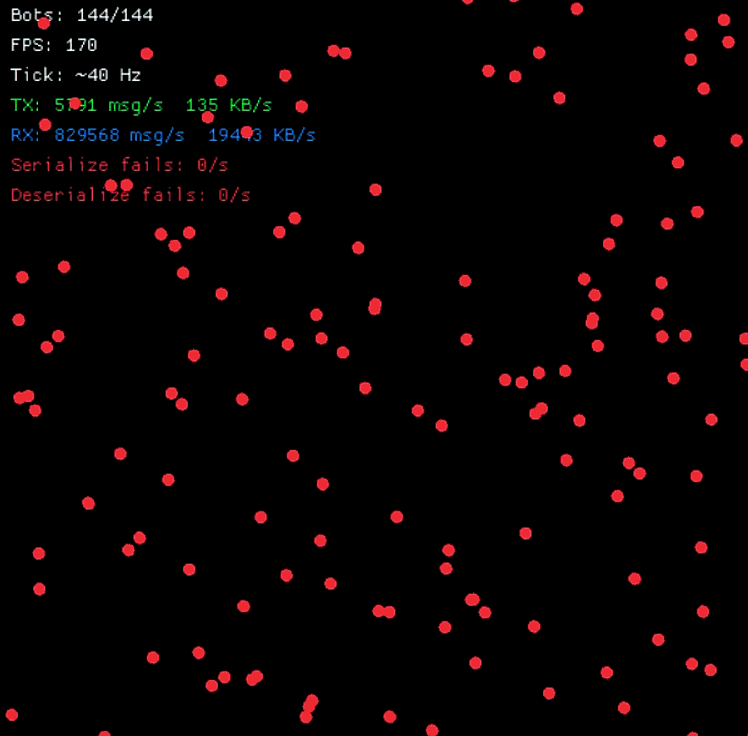

### Quick rant/yap

[](https://pokemondb.net/pokedex/groudon)
[](https://pokemondb.net/pokedex/rayquaza)
[](https://pokemondb.net/pokedex/kyogre)

[](https://pokemondb.net/pokedex/zekrom)
[](https://pokemondb.net/pokedex/reshiram)
[](https://pokemondb.net/pokedex/kyurem)

Networking in games is pure suffering.

You start with “just a simple relay server.” *(alone let authoritative servers)*
Just a few sockets. A couple messages. Clean.
Few hours later:
you’re debugging why one packet arrives in the future, one in the past, and one simply refuses to exist.
You forget the game.
The game forgets you.
Now it’s just you, a growing pile of networking code,
and a silent client that *definitely* connected but somehow didn’t.
You promise yourself:
“just one more fix”
Congratulations.
You are now in a long-term relationship with a race condition.
Days pass.
You no longer render frames.
You render logs.
At some point, you question reality:
“is UDP unordered, or am I?”
Eventually, you accept it.
There is no game.
There never was.
Only packets.
Only retries.
Only pain.

**Dakara watashi ga anata o sukutte agemashou**

This will be a very simple AND opinionated game network libray not a daemon
`(You will still need to embed it in a server wrapper or something, 
and also this is not a Authoritative server library, thought it can be made with more hooks and callbacks, 
but the main point is effortlessly broadcasting with high tick rate and low-memory usage)`

> Note: This is very experimental.
> I am making this for learning networking and get familiar with tokio ecosystem,
> but I will try to make it as usable as possible

Checkout: [Examples](examples) for usage cases and [Docs](docs.md) for right way to use this library

Usage (I don't like release cycles and versioning, so just use local)

```toml
[dependencies]
game-server = { git = "https://github.com/ronakgh97/ghost-sync" }
```



Tick rate: 60 hz
Bot-client: 128

`N * C msg/second for each broadcast, so (N - 1) * (N * C) msg/second in total broadcast`

*That's 58,521,600 msg/second with 512 mb buffer channel*

TODO

Better lib design, currently its just a mess of functions and structs, need to refactor it into a more usable and
intuitive API
Add more examples, maybe a mini-game?
Experimental UDP support, maybe using QUIC?
Add tuned buffering and improve performance by lessen serialization and deserialization, where possible (Zero-copy,
etc.)
Fixed the DAMN BACKPRESSURE, CHANNEL GETS FULL AND THEN EVERYTHING BLOWS UP
